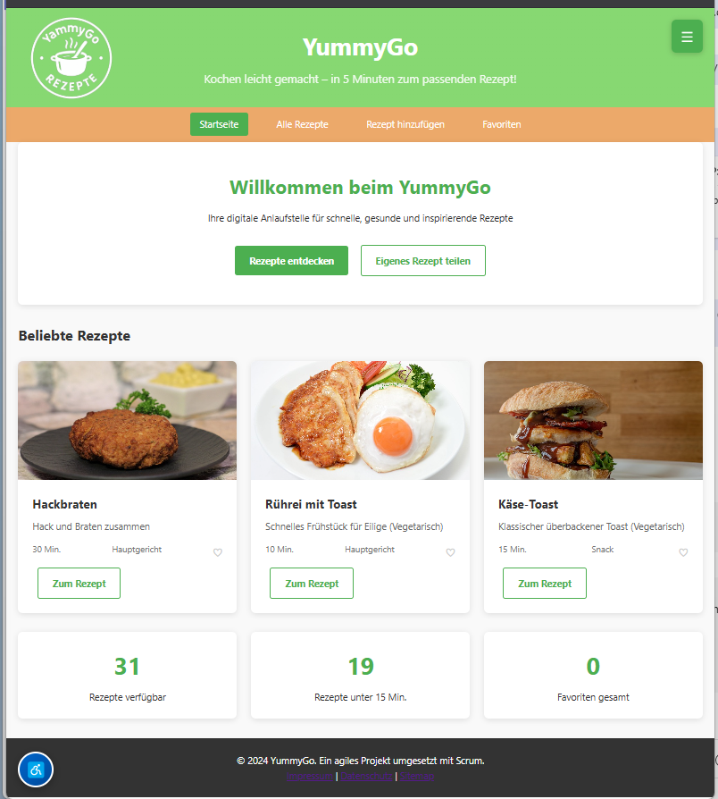

# YummyGo 🍳

> **Die intelligente Rezept-Plattform für moderne Köche**



---

## 📋 Inhaltsverzeichnis

1. [Produktvision](#-produktvision)
2. [Technische Architektur](#-technische-architektur)
3. [Funktionen & Features](#-funktionen--features)
4. [Benutzererlebnis](#-benutzererlebnis)
5. [Agiles Projektmanagement](#-agiles-projektmanagement-mit-scrum)
6. [Installation & Deployment](#-installation--deployment)
7. [Entwicklerdokumentation](#-entwicklerdokumentation)

---

# Wichtige Änderungen (Stand November 2025)

---

## Neue Features & Bugfixes

- **PDF-Export:**
  - Emojis und Sonderzeichen werden in der PDF-Ausgabe automatisch durch Klartext ersetzt (z.B. „Kategorie:“ statt „📁 Kategorie:“), um Darstellungsprobleme zu vermeiden.
  - Die PDF-Ausgabe ist jetzt rein deutsch/ASCII und kompatibel mit allen PDF-Viewern.
  - Der Button „Nur Favoriten als PDF“ wurde entfernt, Export ist nur noch für alle Rezepte möglich.

- **Sidebar & Navigation:**
  - Sidebar-Links und Navigation wurden aktualisiert (Changelog-Link entfernt, FAQ/Kontakt/Impressum ergänzt).
  - FAQ- und Kontaktseiten enthalten realistische Beispielinhalte und Formulare.
  - Impressum und Datenschutz mit Musterdaten gefüllt.

- **Barrierefreiheit & Usability:**
  - Meta-Tag für UTF-8 in allen HTML-Dateien gesetzt.
  - Screenreader- und Tastatur-Navigation verbessert.

- **Datenbank & Rezepte:**
  - Alle Rezepte werden lokal im Browser gespeichert (SQL.js + LocalStorage).
  - Test- und Reset-Seiten für die Datenbank verfügbar.

---

## Hinweise zur PDF-Ausgabe

- Die PDF-Funktion exportiert Rezepte ausschließlich mit Klartext (keine Emojis/Sonderzeichen).
- Für korrekte Darstellung bitte nur deutsche/ASCII-Zeichen in Rezeptdaten verwenden.
- Die PDF-Generierung erfolgt komplett clientseitig, keine Daten werden übertragen.

---

## Letzte Seitenstruktur

- **Export:** Rezepte als PDF/JSON exportieren, Datenbank sichern
- **FAQ:** Häufige Fragen zur App
- **Kontakt:** Kontaktformular und Beispiel-Daten
- **Impressum/Datenschutz/AGB:** Rechtliche Informationen
- **Sidebar:** Navigation zu allen Haupt- und Infoseiten, externe Links

---

Weitere Details siehe Quellcode und Einzeldateien im Ordner `Koch_App_2/`.

---

## 🎯 Produktvision

### Problemstellung
In unserer schnelllebigen Zeit fehlt vielen Menschen die Zeit und Inspiration fürs Kochen:
- 📱 Überflutung mit komplexen Rezepten
- ⏰ Zeitdruck im Alltag
- 🤔 Schwierige Auswahl bei tausenden Rezepten
- 📚 Unübersichtliche Rezeptsammlungen

### Unsere Lösung: YummyGo

Der **YummyGo** ist die digitale Anlaufstelle für **schnelle, gesunde und inspirierende Rezepte**.

#### Kernwerte
- **Geschwindigkeit:** In unter 5 Minuten zum passenden Rezept
- **Einfachheit:** Intuitive Bedienung ohne Lernkurve
- **Zugänglichkeit:** Funktioniert überall, keine Installation nötig
- **Personalisierung:** Favoriten und individuelle Sammlungen

#### Mission Statement
> "Kochen leicht gemacht – in 5 Minuten zum passenden Rezept!"

#### Zielgruppen
- 🎓 **Studierende:** Schnelle, günstige Rezepte für den Uni-Alltag
- 💼 **Berufstätige:** Gesunde Mahlzeiten trotz Zeitdruck
- 👨‍🍳 **Kochanfänger:innen:** Schritt-für-Schritt zu Kocherfolgen
- 👨‍👩‍👧‍👦 **Familien:** Abwechslungsreiche Familienküche

### Alleinstellungsmerkmale (USPs)

1. **Browser-basierte Datenbank** - Keine Cloud, keine Registrierung
2. **Offline-fähig** - Funktioniert auch ohne Internet
3. **Zero-Installation** - Einfach Browser öffnen und loslegen
4. **Privacy First** - Alle Daten bleiben lokal im Browser
5. **Open Source** - Transparent und erweiterbar

---

## 💻 Technische Architektur

### Architektur-Überblick

```
┌─────────────────────────────────────────────┐
│           Browser (Client)                   │
├─────────────────────────────────────────────┤
│  HTML5 | CSS3 | JavaScript (ES6+)           │
├─────────────────────────────────────────────┤
│  SQL.js (SQLite in WebAssembly)             │
├─────────────────────────────────────────────┤
│  LocalStorage (Persistenz)                  │
└─────────────────────────────────────────────┘
         ↓
    Kein Server benötigt!
```

### Technologie-Entscheidungen

#### Warum Browser-basiert?
- ✅ **Keine Serverkosten** - Hosting auf jedem Standard-Webspace
- ✅ **Datenschutz** - Daten bleiben beim Nutzer
- ✅ **Geschwindigkeit** - Keine Netzwerk-Latenzen
- ✅ **Offline-Fähigkeit** - Funktioniert ohne Internet
- ✅ **Einfaches Deployment** - Dateien hochladen, fertig

#### Warum SQL.js statt Backend-Datenbank?
- 📦 SQLite vollständig im Browser (WebAssembly)
- 🚀 Keine API-Aufrufe - sofortige Antworten
- 💾 Automatische Persistierung via LocalStorage
- 🔒 Maximale Privatsphäre - keine Datenübertragung
- 🎯 Relationale Datenbank mit vollem SQL-Support

### Technologie-Stack im Detail

| Komponente | Technologie | Zweck |
|------------|-------------|-------|
| **Frontend** | HTML5, CSS3, JavaScript (ES6+) | Benutzeroberfläche |
| **Datenbank** | SQL.js v1.8.0 | SQLite in WebAssembly |
| **Persistenz** | Browser LocalStorage | Datenspeicherung |
| **Styling** | Vanilla CSS (kein Framework) | Responsive Design |
| **Icons** | Unicode Emojis | Leichtgewichtige Icons |
| **CDN** | Cloudflare (SQL.js) | Externe Bibliotheken |

### Dual-Version Setup

Das Projekt enthält zwei parallele Implementierungen:

```
027_Koch_app/
├── Koch_App_2/          👈 PRODUKTIV-VERSION
│   ├── index.html       (Client-only, wird deployed)
│   ├── recipes.html
│   ├── style.css
│   ├── script.js
│   ├── recipe-db.js     (SQL.js Integration)
│   └── sidebar.js       (Navigation)
│
├── Koch_app_1/          (Entwicklungs-Version)
│   ├── app.py           (Flask Backend)
│   ├── templates/
│   └── static/
│
└── update_sidebar.py    (Build-Skript)
```

#### Koch_App_2 (Produktiv) 🚀
- Pure client-side Implementierung
- Wird auf Webspace deployed
- **Keine Python-Laufzeit benötigt**
- Läuft auf: https://kochapp.multi-channel-network.de/

#### Koch_app_1 (Entwicklung) 🔧
- Flask-basierte Backend-Version
- Für lokale Entwicklung und Tests
- Wird NICHT deployed

### Datenbankschema

```sql
CREATE TABLE recipes (
    id INTEGER PRIMARY KEY AUTOINCREMENT,
    title TEXT NOT NULL,
    description TEXT,
    ingredients TEXT NOT NULL,        -- Line-separated list
    instructions TEXT NOT NULL,       -- Step-by-step guide
    preparation_time INTEGER,         -- In minutes
    category TEXT,                    -- e.g., "Hauptgericht", "Dessert"
    image_url TEXT,                   -- External image URL
    calories INTEGER,                 -- Nutritional info
    is_favorite BOOLEAN DEFAULT 0,    -- User preference
    created_at DATETIME DEFAULT CURRENT_TIMESTAMP
);
```

### Dateistruktur (Koch_App_2)

```
Koch_App_2/
├── index.html              # Startseite mit Featured Recipes
├── recipes.html            # Alle Rezepte mit Suchfunktion
├── add-recipe.html         # Formular zum Hinzufügen
├── favorites.html          # Favoriten-Sammlung
├── recipe-detail.html      # Detailansicht eines Rezepts
├── team.html               # Über uns / Team
├── tutorial.html           # Bedienungsanleitung
├── kontakt.html            # Kontaktformular
├── faq.html                # Häufige Fragen
├── impressum.html          # Rechtliches
├── datenschutz.html        # DSGVO-Informationen
├── agb.html                # Nutzungsbedingungen
├── app.html                # Mobile App Info (Minified)
├── changelog.html          # Versionshistorie (Minified)
├── community.html          # Community Features (Minified)
├── export.html             # Export-Funktionen (Minified)
├── feedback.html           # Feedback-Formular (Minified)
├── style.css               # Haupt-Stylesheet (~500 Zeilen)
├── script.js               # UI-Logik (~320 Zeilen)
├── recipe-db.js            # Datenbank-Layer (~620 Zeilen)
├── sidebar.js              # Toggle-Navigation (~25 Zeilen)
├── test-db.html            # Datenbank-Inspektor
├── reset-db.html           # LocalStorage löschen
└── images/                 # Rezeptbilder

---

## 🚀 Funktionen & Features

### MVP (Minimum Viable Product) - Sprint 1 ✅

#### 1. Rezeptdarstellung
- **Startseite** mit Featured Recipes (Top 3)
- **Grid-Layout** für optimale Übersicht
- **Rezeptkarten** mit Bild, Titel, Beschreibung, Zubereitungszeit
- **Statistik-Dashboard** (Anzahl Rezepte, schnelle Rezepte, Favoriten)

#### 2. Rezeptdetails
- **Vollständige Ansicht** mit allen Informationen
- **Zutaten-Liste** mit Mengenangaben
- **Schritt-für-Schritt Anleitung** nummeriert
- **Meta-Informationen** (Zeit, Kalorien, Kategorie)
- **Favoriten-Button** mit Herz-Icon ❤️
- **Teaser-Bild** zur visuellen Ansprache

#### 3. Rezept erstellen
- **Intuitive Formular-Eingabe**
  - Titel (erforderlich)
  - Beschreibung
  - Zutaten (Textarea, eine pro Zeile)
  - Anleitung (Textarea, Schritte)
  - Zubereitungszeit (in Minuten)
  - Kategorie (Dropdown)
  - Bild-URL (optional)
  - Kalorien (optional)
- **Validierung** vor dem Speichern
- **Sofortige Anzeige** nach Hinzufügen

#### 4. Datenspeicherung & Persistenz
- **SQLite-Datenbank** im Browser
- **Automatisches Speichern** bei jeder Änderung
- **LocalStorage-Backup** als Base64
- **31 Demo-Rezepte** vorinstalliert
- **Migration-Support** für Schema-Updates

#### 5. Favoriten-System
- **Ein-Klick Favorisierung** (Toggle-Button)
- **Dedizierte Favoriten-Seite**
- **Counter** auf Startseite
- **Persistente Speicherung**

### Erweiterte Features - Sprint 2 ✅

#### 6. Suchfunktion
- **Volltext-Suche** in Titel, Beschreibung, Zutaten
- **Echtzeit-Ergebnisse** während der Eingabe
- **Hervorhebung** von Suchbegriffen
- **Keine Ergebnisse?** Hilfreiche Meldung

#### 7. Navigation & UI
- **Toggle-Sidebar** (ausblendbar)
  - Öffnen per ☰ Button (rechts oben)
  - Schließen per Overlay-Klick oder ESC-Taste
  - Smooth Animation (0.3s)
- **Responsive Design**
  - Desktop: Sidebar 280px breit
  - Tablet: Sidebar 220px breit
  - Mobile: Sidebar 100% breit
- **Strukturierte Navigation**
  - Hauptseiten (Startseite, Rezepte, Hinzufügen, Favoriten)
  - Informationen (Team, Kontakt, FAQ, Tutorial)
  - Features (Export, Feedback, Changelog, Community, App)
  - Externe Links (Kanbanboard, Stadtwettkampf, GitHub)
  - Rechtliches (Impressum, Datenschutz, AGB)

#### 8. Content-Seiten
- **Team-Seite** - Projektinfo und Technologie
- **Tutorial-Seite** - 5-Schritte Anleitung
- **FAQ-Seite** - Häufige Fragen
- **Kontakt-Seite** - Kontaktmöglichkeiten

#### 9. Developer Tools
- **test-db.html** - Datenbank-Inspektor
  - Zeigt alle Rezepte
  - Spalten-Übersicht
  - Export-Funktionen
- **reset-db.html** - Datenbank zurücksetzen
  - LocalStorage löschen
  - Zurück zu Demo-Daten

### Geplante Features - Sprint 3 🔮

#### 10. Filter & Kategorien
- Filter nach Zubereitungszeit (< 15, 15-30, 30-60, > 60 Min)
- Filter nach Kalorien (low, medium, high)
- Kategorie-Filter (Frühstück, Hauptgericht, Dessert, etc.)
- Mehrfach-Auswahl möglich

#### 11. Export-Funktionen
- **JSON-Export** - Maschinenlesbar
- **CSV-Export** - Excel-kompatibel
- **PDF-Export** - Druckoptimiert
- **Einzelrezept-Export**
- **Favoriten-Export**

#### 12. Erweiterte Suche
- **Zutaten-basiert** - "Was kann ich mit X kochen?"
- **Ausschluss-Filter** - "Alles außer Y"
- **Fortgeschrittene Operatoren** (AND, OR, NOT)

#### 13. Bewertungssystem
- **Sterne-Bewertung** (1-5 Sterne)
- **Kommentare** zu Rezepten
- **"Habe ich gekocht"** Marker
- **Bewertungs-Statistik**

#### 14. Zufallsgenerator
- **"Überrasch mich!"** Button
- **Zufallsrezept** aus allen Rezepten
- **Zufallsrezept** aus Favoriten
- **Filter-Optionen** auch bei Zufall

### Feature-Vergleich

| Feature | MVP (Sprint 1) | Sprint 2 | Sprint 3 |
|---------|----------------|----------|----------|
| Rezepte anzeigen | ✅ | ✅ | ✅ |
| Rezepte hinzufügen | ✅ | ✅ | ✅ |
| Favoriten | ✅ | ✅ | ✅ |
| Suche | ❌ | ✅ | ✅ |
| Navigation Sidebar | ❌ | ✅ | ✅ |
| Content-Seiten | ❌ | ✅ | ✅ |
| Filter | ❌ | ❌ | 🔮 |
| Export | ❌ | ❌ | 🔮 |
| Bewertungen | ❌ | ❌ | 🔮 |
| Zufallsrezept | ❌ | ❌ | 🔮 |

---

## 🎨 Benutzererlebnis

### Design-Philosophie

**"Form follows function"** - Jedes Design-Element dient einem Zweck

#### Designprinzipien
1. **Minimalismus** - Fokus auf das Wesentliche
2. **Klarheit** - Keine versteckten Funktionen
3. **Konsistenz** - Einheitliche Bedienung
4. **Feedback** - Sofortige Rückmeldung bei Aktionen
5. **Fehlertoleranz** - Hilfreiche Fehlermeldungen

### Farbschema

```css
Primärfarbe:    #4CAF50  (Grün) - Frisch, natürlich, gesund
Sekundärfarbe:  #45a049  (Dunkelgrün) - Akzente und Hover
Hintergrund:    #f9f9f9  (Hellgrau) - Sanft, nicht blendend
Text:           #333     (Dunkelgrau) - Lesbar, nicht zu hart
Sidebar:        #2c3e50  (Blaugrau) - Modern, professionell
Overlay:        rgba(0,0,0,0.5) - Halbtransparent
```

#### Farb-Psychologie
- **Grün:** Natur, Frische, Gesundheit, Wachstum
- **Weiß/Hellgrau:** Sauberkeit, Einfachheit, Raum
- **Dunkelgrau:** Eleganz, Professionalität

### Typografie

- **Schriftart:** 'Segoe UI', Tahoma, Geneva, Verdana, sans-serif
  - System-Schriftart = Schnell ladend
  - Gut lesbar auf allen Geräten
  - Professionelles Erscheinungsbild

- **Schriftgrößen:**
  - H1 (Haupttitel): 2.5rem (40px)
  - H2 (Seitentitel): 2rem (32px)
  - H3 (Abschnitte): 1.5rem (24px)
  - Body Text: 1rem (16px)
  - Kleine Texte: 0.9rem (14px)

### Responsive Design

#### Mobile First Ansatz
Design beginnt bei kleinen Bildschirmen, dann Erweiterung für größere.

```css
/* Base: Mobile (< 768px) */
.container { max-width: 100%; padding: 0 15px; }
.sidebar { width: 100%; }

/* Tablet (768px - 992px) */
@media (min-width: 768px) {
    .sidebar { width: 220px; }
}

/* Desktop (> 992px) */
@media (min-width: 992px) {
    .container { max-width: 1200px; }
    .sidebar { width: 280px; }
}
```

#### Breakpoints
- **Mobile:** < 768px - Stapel-Layout, große Touch-Targets
- **Tablet:** 768px - 992px - 2-spaltig, kompakte Sidebar
- **Desktop:** > 992px - Volle Features, große Sidebar

### Usability-Prinzipien

#### 1. **Drei-Klick-Regel**
Jede Funktion ist in maximal 3 Klicks erreichbar:
- Startseite → Rezept → Details ✅
- Startseite → Suchen → Ergebnis → Details ❌ (aber akzeptabel)

#### 2. **Konsistente Navigation**
- Logo links (zurück zur Startseite)
- Haupt-Navigation zentral
- Menu-Button rechts oben (☰)
- Footer mit Links am Seitenende

#### 3. **Visuelle Hierarchie**
- Größere Elemente = wichtiger
- Farbige Buttons = Call-to-Action
- Grau = sekundäre Informationen

#### 4. **Feedback & Bestätigung**
- Hover-Effekte bei allen interaktiven Elementen
- Loading-Indikatoren bei Datenbank-Operationen
- Success-Meldungen nach Aktionen
- Error-Meldungen mit Lösungsvorschlägen

#### 5. **Barrierefreiheit**
- Semantisches HTML (header, nav, main, footer)
- ARIA-Labels für Screenreader
- Keyboard-Navigation (Tab, Enter, ESC)
- Ausreichende Kontraste (WCAG AA)
- Touch-Targets mindestens 44x44px

### User Flows

#### Rezept finden (Haupt-Use-Case)
```
Start → Rezepte-Seite → Suche eingeben → Rezept auswählen → Details lesen
        (1 Klick)      (Tippen)       (1 Klick)        (Lesen)
⏱️ Geschätzte Zeit: 15-30 Sekunden
```

#### Rezept hinzufügen
```
Start → Hinzufügen → Formular ausfüllen → Speichern → Bestätigung
        (1 Klick)    (Eingabe)          (1 Klick)   (Anzeige)
⏱️ Geschätzte Zeit: 2-3 Minuten
```

#### Favorit markieren
```
Rezept-Detail → Herz-Icon klicken → Bestätigung (visuell)
                (1 Klick)           (Instant)
⏱️ Geschätzte Zeit: < 1 Sekunde
```

### Performance-Optimierung

#### Ladezeiten
- **Initial Load:** < 2 Sekunden
  - HTML: ~50KB
  - CSS: ~15KB
  - JavaScript: ~50KB
  - SQL.js: ~900KB (CDN, gecacht)

- **Navigation:** < 100ms
  - Alle Seiten sind lokal
  - Keine Server-Requests

- **Datenbank-Abfragen:** < 50ms
  - SQLite ist schnell
  - Alles im RAM

#### Optimierungstechniken
- CSS in `<head>` = schnelles First Paint
- JavaScript am Ende = non-blocking
- Lazy Loading für Bilder (zukünftig)
- Minified HTML für Feature-Pages
- Browser-Caching nutzen

---

## 📋 Agiles Projektmanagement mit Scrum

### Warum Agil statt Wasserfall?

#### Traditionelles Wasserfallmodell
```
Anforderungen → Design → Implementierung → Test → Deployment
    ↓              ↓            ↓            ↓         ↓
 Monate        Monate       Monate        Wochen    Tage
                    ↓
            Ergebnis nach 6-12 Monaten
            Feedback erst am Ende
            Änderungen sehr teuer
```

#### Agiles Scrum-Modell
```
Sprint 1 (2 Wochen) → [Plan → Build → Test → Review] → Produkt-Inkrement
Sprint 2 (2 Wochen) → [Plan → Build → Test → Review] → Produkt-Inkrement
Sprint 3 (2 Wochen) → [Plan → Build → Test → Review] → Produkt-Inkrement
                              ↓
                    Nutzbares Produkt alle 2 Wochen
                    Kontinuierliches Feedback
                    Änderungen willkommen
```

### Scrum vs. Klassisches PM im Vergleich

| Aspekt | Klassisch (Wasserfall) | Agil (Scrum) |
|--------|------------------------|--------------|
| **Vorgehensweise** | Linear, Phasen nacheinander | **Iterativ, in Sprints** |
| **Planungshorizont** | Gesamtprojekt vorher | Sprint-weise |
| **Flexibilität** | Änderungen teuer und riskant | **Änderungen erwünscht** |
| **Fokus** | Zeit, Budget, Umfang (Scope) | **Kundennutzen, Qualität** |
| **Risikomanagement** | Am Ende (bei Abnahme) | Kontinuierlich |
| **Ergebnis** | Fertiges Produkt am Ende | **Laufend nutzbare Inkremente** |
| **Kundenfeedback** | Erst bei Auslieferung | Nach jedem Sprint |
| **Team-Struktur** | Hierarchisch, spezialisiert | **Selbstorganisiert, crossfunktional** |
| **Dokumentation** | Umfassend und detailliert | Lean und zielgerichtet |
| **Erfolgsmaß** | Termin- und Budget-Treue | Kundenzufriedenheit |

### Die 3 Scrum-Rollen

#### 1. Product Owner (PO) 🎯
**Verantwortung:** Was wird gebaut?

- ✅ Repräsentiert Kunden und Stakeholder
- ✅ Verantwortet wirtschaftlichen Erfolg (ROI)
- ✅ Priorisiert das Product Backlog
- ✅ Definiert Akzeptanzkriterien
- ✅ Nimmt Sprint-Ergebnisse ab
- ❌ Gibt KEINE technischen Lösungen vor
- ❌ Managt NICHT das Team

**Tägliche Aufgaben:**
- Backlog pflegen und priorisieren
- User Stories schreiben
- Stakeholder-Anfragen bewerten
- Sprint Reviews durchführen

**Erfolgsmetriken:**
- Business Value geliefert
- Kundenzufriedenheit
- ROI des Produkts

#### 2. Scrum Master (SM) 🛡️
**Verantwortung:** Wie wird zusammengearbeitet?

- ✅ Stellt Scrum-Framework sicher
- ✅ Beseitigt Hindernisse (Impediments)
- ✅ Moderiert Team-Zusammenarbeit
- ✅ Schützt Team vor Störungen
- ✅ Coacht Team und Organisation
- ❌ Ist KEIN Projektmanager
- ❌ Verteilt KEINE Aufgaben

**Tägliche Aufgaben:**
- Daily Scrum moderieren
- Impediments identifizieren und lösen
- Team bei Scrum-Praktiken unterstützen
- Retrospektiven facilitieren

**Erfolgsmetriken:**
- Team-Produktivität steigt
- Impediments werden gelöst
- Scrum wird gelebt

#### 3. Entwicklungsteam 👥
**Verantwortung:** Wie wird es gebaut?

- ✅ Setzt Anforderungen technisch um
- ✅ Selbstorganisiert (keine Hierarchie)
- ✅ Crossfunktional (alle Skills vorhanden)
- ✅ Verantwortlich für Qualität
- ✅ Schätzt Aufwände
- ✅ Definiert "Definition of Done"
- ❌ Optimal 5-9 Personen

**Tägliche Aufgaben:**
- Code entwickeln
- Tests schreiben
- Code Reviews
- Pair Programming
- Daily Scrum

**Erfolgsmetriken:**
- Velocity (Story Points pro Sprint)
- Code Quality
- Sprint Goal erreicht

### Scrum Artefakte

#### 1. Product Backlog 📋
Priorisierte Liste aller Anforderungen

**Eigenschaften:**
- Lebendiges Dokument (nie fertig)
- Vom Product Owner verantwortet
- Nach Business Value sortiert
- Enthält User Stories, Bugs, technische Tasks

**Beispiel-Einträge:**
```
[Prio 1] Als Nutzer möchte ich Rezepte suchen können
[Prio 2] Als Koch möchte ich meine Favoriten speichern
[Prio 3] Als Admin möchte ich Statistiken sehen
[Prio 4] Bug: Sidebar schließt nicht auf Mobile
[Prio 5] Tech Debt: SQL.js auf v1.9 updaten
```

#### 2. Sprint Backlog 📝
Aufgaben für den aktuellen Sprint

**Eigenschaften:**
- Vom Team im Sprint Planning ausgewählt
- Team committed sich dazu
- Enthält Tasks mit Stunden-Schätzungen
- Wird täglich aktualisiert

**Beispiel (Sprint 2):**
```
User Story: Suche implementieren (8 SP)
  ├─ [4h] Suchfeld im UI erstellen
  ├─ [6h] SQL-Query für Volltext-Suche
  ├─ [3h] Ergebnis-Liste anzeigen
  └─ [2h] Tests schreiben
  
User Story: Sidebar-Navigation (5 SP)
  ├─ [3h] HTML-Struktur
  ├─ [4h] CSS für Toggle-Animation
  └─ [3h] JavaScript für Interaktion
```

#### 3. Produkt-Inkrement 📦
Das fertige, nutzbare Ergebnis

**Definition of Done (DoD):**
- ✅ Code ist geschrieben
- ✅ Tests sind grün
- ✅ Code Review durchgeführt
- ✅ Dokumentation aktualisiert
- ✅ Auf Test-System deployed
- ✅ Von Product Owner abgenommen

### User Stories schreiben

#### Format
```
Als [Rolle]
möchte ich [Funktion]
um [Nutzen] zu erreichen.
```

#### Beispiele aus dem Projekt
```
✅ Gute User Story:
Als Kochanfänger
möchte ich Rezepte nach Zubereitungszeit filtern,
um schnelle Gerichte für den Feierabend zu finden.

Akzeptanzkriterien:
- Filter-Dropdown mit Optionen (<15min, 15-30min, >30min)
- Ergebnisse werden sofort aktualisiert
- Anzahl der gefilterten Rezepte wird angezeigt

❌ Schlechte User Story:
"Die App braucht Filter"
(Keine Rolle, kein Nutzen, nicht testbar)
```

#### INVEST-Kriterien für User Stories
- **I**ndependent - Unabhängig von anderen Stories
- **N**egotiable - Verhandelbar in Details
- **V**aluable - Wertv oll für den Nutzer
- **E**stimable - Aufwand schätzbar
- **S**mall - Klein genug für einen Sprint
- **T**estable - Testbar mit Akzeptanzkriterien

### Story Points & Schätzung

#### Was sind Story Points?
Relative Maßeinheit für Komplexität, Aufwand und Unsicherheit.

#### Fibonacci-Skala
```
1 - Trivial (z.B. Text ändern)
2 - Sehr einfach (z.B. Button hinzufügen)
3 - Einfach (z.B. neue Seite mit Copy-Paste)
5 - Mittel (z.B. Suchfunktion implementieren)
8 - Komplex (z.B. Datenbank-Migration)
13 - Sehr komplex (z.B. Export-Feature)
21 - Epic (zu groß, muss aufgeteilt werden)
```

#### Planning Poker
1. Product Owner stellt User Story vor
2. Team diskutiert Anforderungen
3. Alle wählen gleichzeitig eine Karte
4. Bei Abweichungen: Diskussion
5. Erneute Schätzung bis Konsens

**Beispiel aus Sprint 2:**
```
Story: "Sidebar-Navigation mit Toggle"
Team schätzt: 3, 5, 5, 8
Diskussion:
  - 3er: "Ist doch nur CSS und ein onclick"
  - 8er: "Aber wir müssen responsive machen und alle Seiten anpassen"
Ergebnis nach Diskussion: 5 SP (Konsens)
```

### Definition of Ready (DoR)

Eine Story ist bereit für den Sprint, wenn:

- ✅ Als User Story formuliert
- ✅ Akzeptanzkriterien definiert
- ✅ Geschätzt (Story Points)
- ✅ Klein genug (max. 13 SP)
- ✅ Abhängigkeiten geklärt
- ✅ Von Team verstanden
- ✅ Testbar

### Scrum Events

#### 1. Sprint Planning (5% der Sprintlänge) 🎯
**Bei 2-Wochen-Sprint: 4 Stunden**

**Planning Teil 1: WAS? (2h)**
- Product Owner präsentiert Top-Backlog-Items
- Team fragt nach und diskutiert
- Sprint Goal wird festgelegt
- Team wählt Stories aus (commitment)

**Planning Teil 2: WIE? (2h)**
- Stories werden in Tasks zerlegt
- Tasks werden geschätzt (in Stunden)
- Team plant die Umsetzung

**Ergebnis:**
- Sprint Goal definiert
- Sprint Backlog gefüllt
- Team hat Plan

**Beispiel Sprint 2 Goal:**
> "Nutzern ermöglichen, schnell durch Rezepte zu navigieren und zu suchen"

#### 2. Daily Scrum (täglich, 15 Min) 🌅
**Zur gleichen Zeit, am gleichen Ort**

**Ablauf (pro Person):**
1. Was habe ich gestern erreicht?
2. Was plane ich heute?
3. Welche Hindernisse habe ich?

**Wichtig:**
- ✅ Steht vor dem Board
- ✅ Timeboxed auf 15 Minuten
- ✅ Nur das Team spricht
- ❌ Keine Problemlösungen (danach)
- ❌ Kein Status-Report an den Chef

**Beispiel:**
```
Anna: "Gestern: Suchfunktion fertig. Heute: Tests schreiben. Keine Blocker."
Ben: "Gestern: Sidebar CSS. Heute: JavaScript. Problem: Ich verstehe die Toggle-Logik nicht."
→ Nach dem Daily: Ben und Anna machen Pair Programming
```

#### 3. Sprint Review (2,5% der Sprintlänge) 🎉
**Bei 2-Wochen-Sprint: 2 Stunden**

**Agenda:**
1. Sprint Goal Review (erreicht?)
2. Live-Demo des Inkrements
3. Feedback von Stakeholdern
4. Product Backlog anpassen
5. Nächste Schritte besprechen

**Teilnehmer:**
- Scrum Team
- Stakeholder
- Kunden (optional)

**Beispiel Sprint 2 Review:**
```
✅ Demo: Suche funktioniert
✅ Demo: Sidebar auf allen Seiten
✅ Demo: Mobile responsive
❌ Nicht geschafft: Filter (wird in Sprint 3 gezogen)

Feedback:
- "Suche ist super schnell!" ✨
- "Sidebar könnte etwas breiter sein" → Backlog
- "Wann kommt Export?" → Priorisierung angepasst
```

#### 4. Sprint Retrospektive (2,5% der Sprintlänge) 🔄
**Bei 2-Wochen-Sprint: 2 Stunden**

**Ziel:** Prozess verbessern, nicht Personen kritisieren

**Format: Start-Stop-Continue**
```
🟢 START: Was sollten wir anfangen?
  - "Code Reviews vor jedem Commit"
  - "Dokumentation parallel zum Code"

🔴 STOP: Was sollten wir aufhören?
  - "Meetings ohne Agenda"
  - "Arbeiten außerhalb der Core Hours"

🔵 CONTINUE: Was sollten wir beibehalten?
  - "Pair Programming bei schwierigen Tasks"
  - "Freitags früher Feierabend"
```

**Ergebnis:**
- 1-3 konkrete Verbesserungsmaßnahmen
- Verantwortlichkeiten festgelegt
- In nächstem Sprint überprüfen

### Sprint-Zyklus visualisiert

```
Woche 1:
Mo: Sprint Planning (4h)
Di-Fr: Development + Daily Scrum (täglich 15min)

Woche 2:
Mo-Do: Development + Daily Scrum
Fr: Sprint Review (2h) + Retrospektive (2h)
    → Neuer Sprint startet Montag

Continuous:
- Product Owner pflegt Backlog
- Scrum Master beseitigt Impediments
- Team entwickelt und testet
```

### Metriken & Transparenz

#### 1. Burndown Chart
Zeigt verbleibende Arbeit im Sprint

```
Story Points
40 |●
35 |  ●
30 |    ●
25 |      ●
20 |        ●
15 |          ●
10 |            ●
 5 |              ●
 0 |________________●
   Tag 1  3  5  7  9  10
```

#### 2. Velocity Chart
Zeigt durchschnittliche Story Points pro Sprint

```
Story Points
30 |     ███
25 |     ███ ███
20 | ███ ███ ███ ███
15 | ███ ███ ███ ███
   Sprint 1 2  3  4
   
Durchschnitt: 25 SP
```

#### 3. Cumulative Flow Diagram
Zeigt Work in Progress

```
Items
50 |           ████ Done
40 |       ████████ In Progress
30 |   ████████████ To Do
20 | ████████████████
   Sprint 1  2  3  4
```

### Vorteile von Scrum für YummyGo

| Vorteil | Konkrete Auswirkung im Projekt |
|---------|-------------------------------|
| **Frühe Releases** | MVP nach Sprint 1 nutzbar |
| **Flexibilität** | Sidebar wurde in Sprint 2 nachträglich eingebaut |
| **Feedback-Loops** | Nutzer konnten MVP testen und Features vorschlagen |
| **Risikominimierung** | Technische Probleme (SQL.js) früh erkannt |
| **Team-Motivation** | Sichtbare Erfolge alle 2 Wochen |
| **Qualität** | Kontinuierliche Code Reviews und Tests |

---

## 📦 Installation & Deployment

### Lokale Entwicklung

1. Dateien in einen Ordner kopieren
2. `index.html` im Browser öffnen
3. Fertig - keine Installation nötig!

### Webspace-Deployment

1. Alle Dateien per FTP auf Webspace hochladen
2. `index.html` als Startseite festlegen
3. App ist sofort verfügbar unter: `https://ihre-domain.de/`

**Keine Konfiguration, keine Datenbank-Setup, kein Python - einfach hochladen und loslegen!**

---

## 🔧 Entwickler-Tools (Optional)

Im Projekt enthalten für Entwicklung:

- **Koch_app_1/**: Flask-Version (Python) - zum lokalen Testen
- **Koch_App_2/**: Produktiv-Version (nur HTML/JS) - für Webspace
- **csv2recipe-db.py**: Konverter CSV → JavaScript

---

## 📚 Analogie: Scrum wie ein Rugby-Spielzug

Scrum funktioniert wie ein **gut eingeübter Rugby-Spielzug**: 
- Jeder Spieler kennt seine Rolle
- Alle haben ein gemeinsames Ziel vor Augen
- Durch tägliche Abstimmungen (Daily Scrum) arbeiten sie als Einheit
- Fehler werden früh sichtbar und korrigiert
- Am Ende des Spielzugs (Sprint) gibt es ein nutzbares Ergebnis

---

## 📄 Lizenz & Copyright

© 2025 YummyGo. Ein agiles Projekt umgesetzt mit Scrum.
